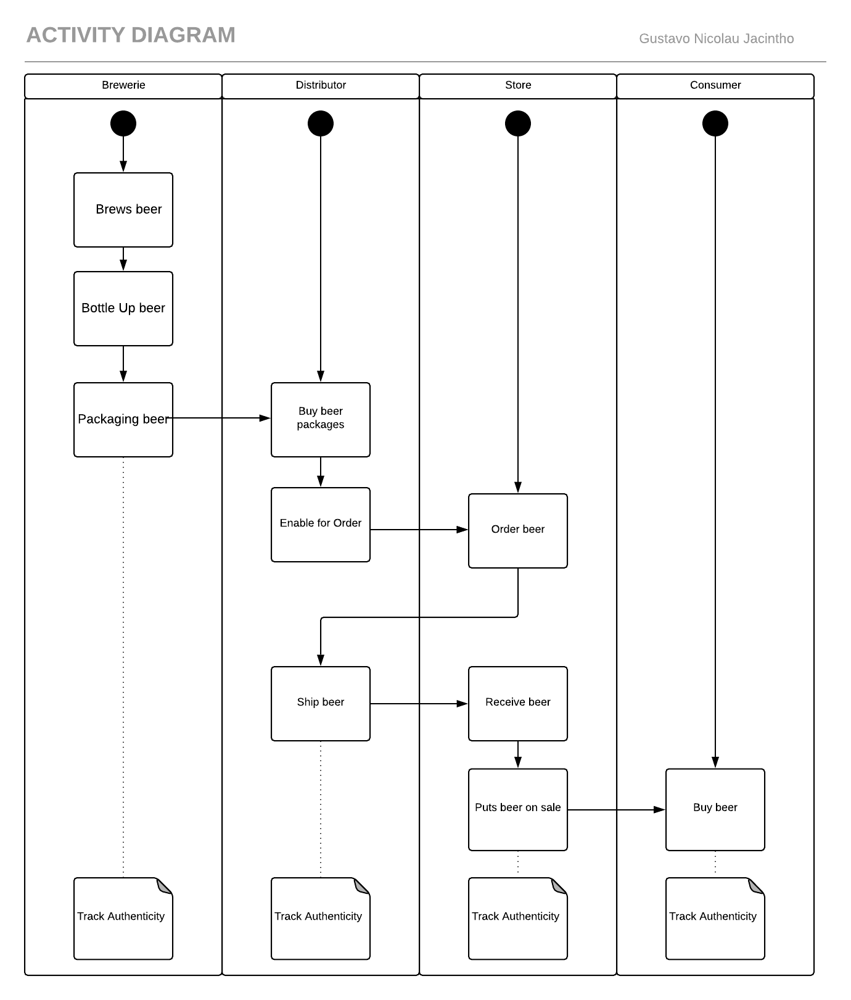
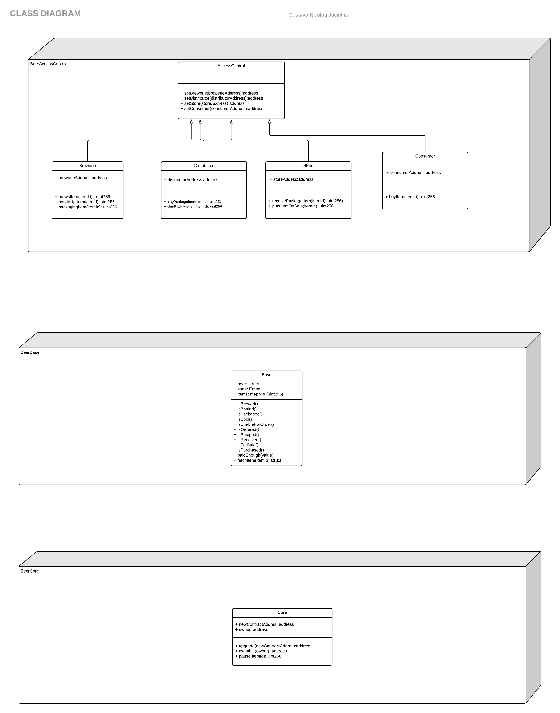
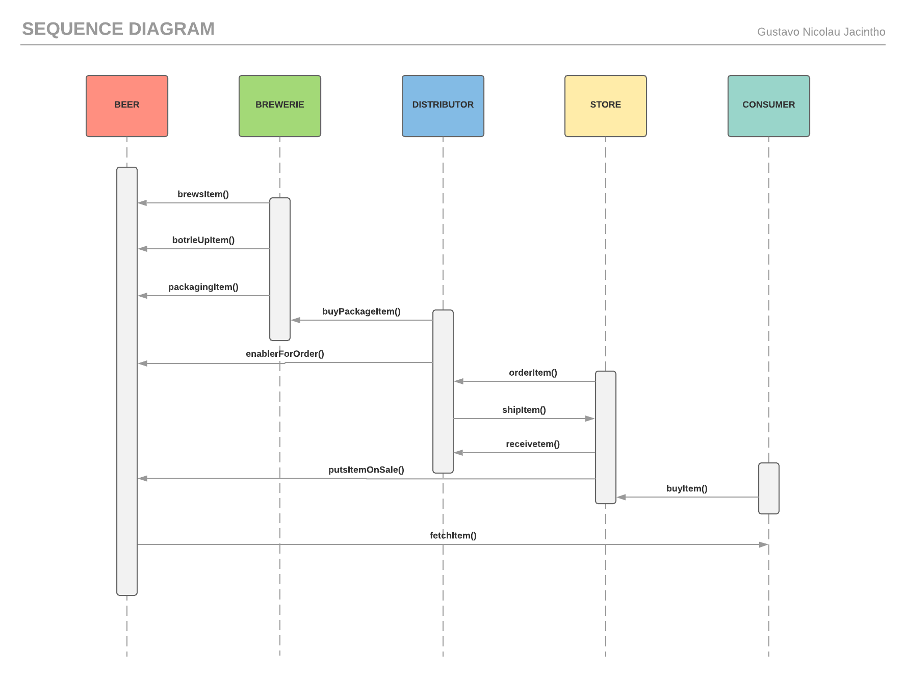
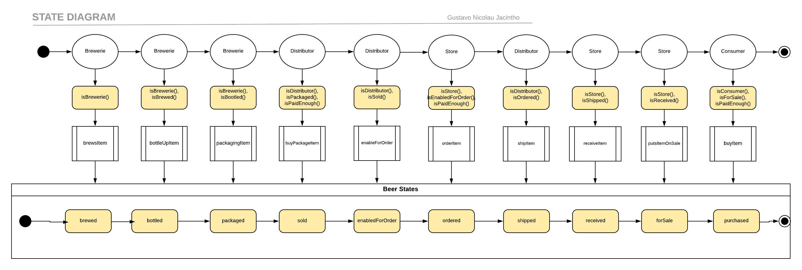
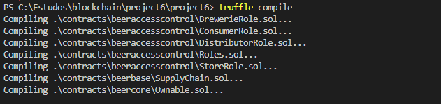
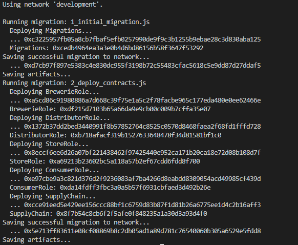
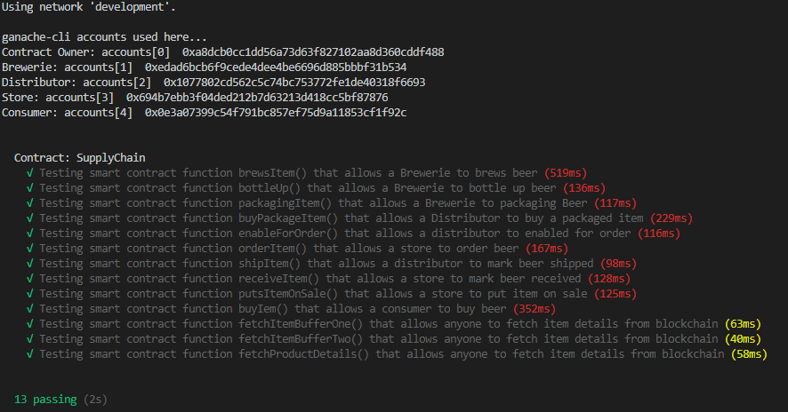

# Supply chain & data auditing

This repository containts an Ethereum DApp that demonstrates a Supply Chain flow between a Seller and Buyer. The user story is similar to any commonly used supply chain process. A Seller can add items to the inventory system stored in the blockchain. A Buyer can purchase such items from the inventory system. Additionally a Seller can mark an item as Shipped, and similarly a Buyer can mark an item as Received.

The DApp User Interface when running should look like...


## UML Diagrams








## Getting Started

These instructions will get you a copy of the project up and running on your local machine for development and testing purposes. See deployment for notes on how to deploy the project on a live system.

### Prerequisites

Please make sure you've already installed ganache-cli, Truffle and enabled MetaMask extension in your browser.

```
node v8.12.0 https://nodejs.org/en/download/
ganache-cli v6.3.0 (ganache-core: 2.4.0) https://www.truffleframework.com/docs/ganache/quickstart
Truffle v4.1.15 (core: 4.1.15) https://www.truffleframework.com/docs/truffle/getting-started/installation
MetaMask 6.0.1 https://metamask.io/
```

### Installing

A step by step series of examples that tell you have to get a development env running

Clone this repository:

```
git clone https://github.com/udacity/nd1309/tree/master/course-5/project-6
```

Install all requisite npm packages (as listed in ```package.json```):

```
npm install
```

Launch Ganache:

```
ganache-cli -m "spirit supply whale amount human item harsh scare congress discover talent hamster"
```

Your terminal should look something like this:


In a separate terminal window, Compile smart contracts:

```
truffle compile
```

Your terminal should look something like this:



This will create the smart contract artifacts in folder ```build\contracts```.

Migrate smart contracts to the locally running blockchain, ganache-cli:

```
truffle migrate
```

Your terminal should look something like this:



Test smart contracts:

```
truffle test
```

All 10 tests should pass.



In a separate terminal window, launch the DApp:

```
npm run dev
```

## Built With

* [Ethereum](https://www.ethereum.org/) - Ethereum is a decentralized platform that runs smart contracts
* [Truffle Framework](http://truffleframework.com/) - Truffle is the most popular development framework for Ethereum with a mission to make your life a whole lot easier.


## Acknowledgments

* Solidity
* Ganache-cli
* Truffle
* Infura


## Deployment on Rinkeby Network

```
 truffle migrate --network rinkeby
Using network 'rinkeby'.

Running migration: 1_initial_migration.js
  Deploying Migrations...
  ... 0x0540b73b15a37bba010a05c6709d78f0300d0619c5cbdf72bbd5ca6c5f3b9069
  Migrations: 0x75d12ef5aa81fc1e2bd6d2f4653ce9f7468cbaa9
Saving successful migration to network...
  ... 0xf34245dea7772701f94f9c978f52baaec08d76d1a2bfd7d7ce6215971f8c105d
Saving artifacts...
Running migration: 2_deploy_contracts.js
  Deploying BrewerieRole...
  ... 0xd326e61a5ac87613e5c5e7193ce5b84e47a9d1fd57c3888621ace9fdf7ee1905
  BrewerieRole: 0x7a562a03e2783865dcde52da7022d97105e8068e
  Deploying DistributorRole...
  ... 0x18153ad31c6204ed4ce6c040877a47ac8aa0d48a9c4a958b5b0a68221073f848
  DistributorRole: 0x39847e6bd3d5881384b03108e32ca0f9e4fb58f7
  Deploying StoreRole...
  ... 0xd3e13e41e65a102de557ee6ae4379dc19e84f70607bea331b5c13bb94375fe27
  StoreRole: 0x8292da740ccb144b8074356b4cb03710571ce8f5
  Deploying ConsumerRole...
  ... 0x165d6da4aa1b7f077466624e188380ad45053e0b90a34e2c70912d1150365e8b
  ConsumerRole: 0x6c7fe82f5542174816b2e0f842cb46f5cd289a38
  Deploying SupplyChain...
  ... 0x123f7c9701f4265f2bbe8b8645013d05437574e4be99958c30d004e42c56a026
  SupplyChain: 0x515194054d71217b97c262664d25ca0bda0b9c0b
Saving successful migration to network...
  ... 0x193bbed168ffffdcdde6cfa6495fe69a6b090467d0e5efb1f91f81dbde5ad30d
Saving artifacts...
```